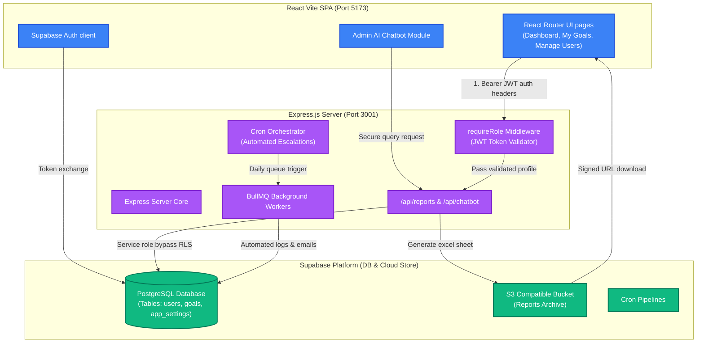

# 🎯 GoalFlow — In-House Goal Setting & Tracking Portal

[](https://github.com/WinterSun23/AtomQuestSubmission)
[](#-technology-stack--architecture)

Welcome to **GoalFlow**, a state-of-the-art digital performance, alignment, and tracking portal built for the **AtomQuest Hackathon 1.0**. 

GoalFlow completely digitizes the employee performance lifecycle, providing organizations with real-time strategic alignment, transparent L1-L3 rule-based escalations, robust audit histories, automated excel reporting, and a secure **Admin AI Chatbot** powered by Groq Llama 3.3.

---

## 🏗️ System Architecture & Data Flow

Below is the complete architectural layout of GoalFlow, showing the interaction between the React SPA client, the Express.js Backend API, and Supabase's secure data layers.



---

## 🚀 Chronological Feature Checklist (Adherence to BRD)

GoalFlow implements the complete performance portal specifications chronologically, according to the official problem statement:

### 📑 1. Phase 1 — Goal Creation & Approval
*   **Goal Sheet Creation**: Employee-facing interface to draft, review, and submit a single Goal Sheet per active cycle.
*   **Thrust Areas & UoM**: Create goals mapped to specific **Thrust Areas** (e.g., Financial, Operational) and assign tailored **Units of Measurement (UoM)**: *Numeric*, *Percentage (%)*, *Timeline*, or *Zero-based*.
*   **Rigorous Validation Engine**: The frontend and backend restrict goal sheets strictly to:
    *   Total weightage across all goals **must equal 100%**.
    *   Minimum weightage per individual goal **must be at least 10%**.
    *   Maximum number of goals per sheet is **8**.
*   **Manager (L1) Approval Workflow**:
    *   Interactive dashboard for reporting managers to review subordinates' drafts.
    *   Ability to **edit targets and weightages inline** during review, or **return for rework** with structured notes.
    *   Upon approval, goal sheets are **instantly locked** preventing further employee modification.
*   **Real-time Shared Goals**:
    *   Administrators can push strategic goals to multiple employees at once.
    *   Recipients can adjust their individual weightage, but the Goal Title, Description, and target values remain **read-only**.
    *   Achievement logs recorded by the primary owner automatically sync to all recipient sheets.

### 📝 2. Phase 2 — Achievement Tracking & Quarterly Check-ins
*   **Quarterly Progress Log**: Employees can record actual achievements against planned targets during active check-in windows.
*   **Status Indicators**: Standardized statuses per goal (*Not Started*, *On Track*, *Completed*).
*   **Manager Review and Feedback**: Managers conduct 1-on-1 performance chats, view planned vs. actual differences, and log audit-ready check-in comments.
*   **Computed Progress Scores**: Automatically computes goal achievements according to UoM types:
    *   **Min (Numeric / %)**: $\text{Achievement} \div \text{Target}$ (Higher is better, capped appropriately).
    *   **Max (Numeric / %)**: $\text{Target} \div \text{Achievement}$ (Lower is better).
    *   **Timeline**: Completion Date vs. Target Date.
    *   **Zero-based**: If Achievement = 0 → 100%, else 0% (Safety incidents, outages, etc.).

---

## 🔒 User Roles & Persona System

GoalFlow features secure, fine-grained access levels, controlled by standard Supabase JWT validation in both frontend routes and backend APIs:

| Role | Core Responsibilities | Portal Capabilities |
| :--- | :--- | :--- |
| **Employee** | Sets performance targets, updates check-ins, logs achievements. | Drafts, edits, and submits goal sheets; updates actuals inside active quarters. |
| **Manager (L1)** | Reviews and approves goals, guides team targets, records comments. | Team tracker dashboard, inline target tuning, feedback logger. |
| **Admin / HR** | Governs cycle parameters, exception unlocks, global audit checks. | Org settings, goal unlocks, real-time heatmaps, **Secure AI Chatbot**. |

---

## 🛡️ Advanced Good-to-Have Integrations

GoalFlow stands out by implementing major enterprise features for maximum governance and user engagement:

### 📧 Automated Email & Notification Engine
*   Integrated **Nodemailer** module triggering immediate emails on:
    *   Goal Sheet Submission (alert to L1 Manager).
    *   Goal Approval/Rejection (alert to Employee with rework notes).
    *   Check-in Milestones & Reminders.
*   **Real-Time WebSockets Notifications**: A persistent server-to-client postgres replication triggers floating alerts immediately on the user's dashboard bell.

### 🚨 Rule-Based Escalation System (L1-L3 Cascade)
*   **Automatic Reminders**: Tracks time-based breaches in performance milestones.
*   **Cascading Rules**:
    *   If an employee does not submit goals within $N$ days of cycle open → Alert L1 Manager.
    *   If the manager has not approved within $N$ days of submission → Escalate to skip-level manager (L2).
    *   If a quarterly check-in is missed → Alert Skip-level manager and notify HR (L3).
*   **BullMQ Workers**: Handled by resilient, low-latency background queue workers checking breaches daily.

### ⚙️ Configurable App Settings
*   **Dynamic Calendar Control**: Admins can override active quarters (Phase 1, Q1, Q2, Q3, Q4) or toggle the goal submission window open/closed live.
*   **Configurable Deadlines**: Set escalation intervals (e.g., $N = 7$ days) directly from the visual settings interface.

---

## 🤖 Secure Admin AI Chatbot (Groq Llama 3.3)

GoalFlow features an interactive, glassmorphic **AI Assistant** available **exclusively** on the Administrator Console.

### 🔐 Multi-Layer Security & Data Privacy
1.  **Exclusively Admin**: Protected at the routing level (react routes) and **securely locked down at the Express backend** using JWT Token verification (`requireAdmin` middleware). Employees or managers attempting to POST to `/api/chatbot/chat` will be met with an immediate `403 Forbidden` response.
2.  **No Hash Exposure**: The server uses a backend Service Role to query Supabase data securely. It extracts **only** non-sensitive columns (`id`, `name`, `email`, `role`, `department_id`, `manager_id`). Under no circumstances are password hashes, recovery keys, or API secrets loaded into memory or fed to the AI.
3.  **Strictly Volatile**: Chats are saved purely in the client React state. No messages or user-bot queries are logged to the database or written to disk, ensuring 100% transience.

---

## 🛠️ Step-by-Step Local Deployment & Setup

### 1. Prerequisites
*   Node.js (v18+)
*   Supabase Local instance or Cloud Project

### 2. Backend Environment Config
Create a file at `backend/.env` (and/or `.env` in the root folder):
```env
# Supabase Configuration
VITE_SUPABASE_URL=https://your-supabase-project.supabase.co
SUPABASE_SERVICE_ROLE_KEY=your-supabase-service-role-secret-key
VITE_SUPABASE_ANON_KEY=your-supabase-anon-key

# Mail SMTP Credentials (Optional for email reminders)
SMTP_HOST=smtp.gmail.com
SMTP_PORT=465
SMTP_USER=your-email@gmail.com
SMTP_PASS=your-app-password

# Groq API Credentials (Required for Chatbot testing)
GROQ_API_KEY=gsk_your_groq_api_token_here
```

### 3. Spin Up Local Servers
In the project root, open two terminal windows:

*   **Terminal 1 (Vite Frontend)**:
    ```bash
    npm install
    npm run dev
    ```
    *(Defaults to `http://localhost:5173`)*

*   **Terminal 2 (Node Express Backend)**:
    ```bash
    cd backend
    npm install
    npm start
    ```
    *(Defaults to `http://localhost:3001`)*

---

## 🔑 Demo Login Credentials

Use these verified accounts to walk through complete portal lifecycles:

*   **Admin Console (AI Chatbot Active)**:
    *   **Email**: `cbersq+admin@gmail.com` | **Password**: `Password123`
*   **L1 Manager Portal**:
    *   **Email**: `cbersq+maintainer1@gmail.com` | **Password**: `Password123`
*   **Employee Portal**:
    *   **Email**: `cbersq+user1@gmail.com` | **Password**: `Password123`

---

*GoalFlow is crafted with ❤️ for the AtomQuest Hackathon 1.0. Engineered for excellence, built for growth.*