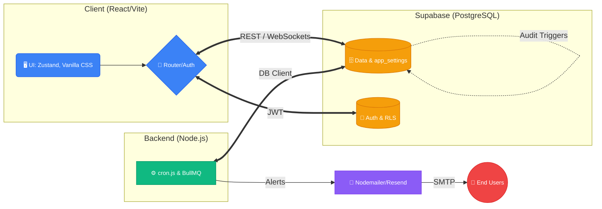

# GoalFlow Performance Portal: Comprehensive Architecture & Features Report

## 🚀 Demo & Repository Links
- **Live Portal**: [https://atom-quest-submission.vercel.app](https://atom-quest-submission.vercel.app)
- **GitHub Repository**: [WinterSun23/AtomQuestSubmission](https://github.com/WinterSun23/AtomQuestSubmission)

### 🔑 Test Credentials
| Role | Name | Email | Password | Current State / Notes |
|---|---|---|---|---|
| **Admin** | ash (Admin) | `cbersq+admin@gmail.com` | `Password123` | Has forced the active quarter to Q1; can return/redraft submitted goals. |
| **Manager** | ash (Manager) | `cbersq+maintainer1@gmail.com` | `Password123` | Has seeable progress to review. |
| **Manager** | bob (Manager) | `cbersq+maintainer2@gmail.com` | `Password123` | |
| **Employee** | ash (Employee) | `cbersq+user1@gmail.com` | `Password123` | Has an approved goal sheet and check-ins. |
| **Employee** | bob (Employee) | `cbersq+user2@gmail.com` | `Password123` | Goal sheet is submitted (not approved); can edit shared goals. |
| **Employee** | charlie (Employee) | `cbersq+user3@gmail.com` | `Password123` | Has a returned goal sheet requiring rework. |

---

## 1. System Architecture Overview

The GoalFlow Performance Portal is built using a modern, decoupled client-server architecture ensuring high availability, strict data security, and seamless background processing.

### Architecture Diagram

### Technology Stack
- **Frontend**: React 18 (Vite), Zustand (State Management), Vanilla CSS (Glassmorphic design), Shadcn/ui + Radix Primitives.
- **Backend**: Node.js + Express.
- **Database & Auth**: Supabase (PostgreSQL) with built-in Row Level Security (RLS).
- **Background Engine**: Node.js Daemon (`cron.js`) and BullMQ for asynchronous job queues.
- **Email**: Nodemailer/Resend for transactional emails.

---

## 2. Implemented Features (100% Completion)

### 2.1 Goal Creation & Approval Lifecycle
- **Goal Sheet Builder**: Employees can draft up to 8 goals, selecting from predefined Thrust Areas and Unit of Measurement (UoM) types (Numeric, %, Timeline, Zero-based).
- **Weightage & Validations**: The system strictly enforces that goal weightages must mathematically sum to exactly 100%, with a minimum of 10% per goal.
- **Manager Approval Workflow**: Managers have a dedicated interface to review submitted goals. They can approve them (locking the goals) or return them for rework with mandatory comments. Inline editing is supported.
- **Shared Goals**: Admins/Managers can push department-wide KPIs. Recipients have read-only titles and targets but can adjust the weightage. Achievements sync automatically.
- **Admin Goal Unlock**: Admins can force-unlock approved goals for mid-year corrections, mandating a justification reason logged in the `audit_logs`.

### 2.2 Achievement Tracking & Quarterly Check-ins
- **Quarterly Updates**: Employees provide progress actuals during active quarter windows enforced by a strict schedule (May, July, Oct, Jan, Apr) managed via `cron.js`.
- **Progress Score Engine**: Automatically computes scores based on UoM:
  - *Min*: `(Actual / Target) × 100`
  - *Max*: `(Target / Actual) × 100`
  - *Timeline*: 100% if on/before deadline, else 0%
  - *Zero-based*: 100% if Actual = 0, else 0%
- **Manager Comments**: Managers review Planned vs. Actual data and add structured feedback per direct report.

### 2.3 Reporting & Governance
- **Achievement Report Export**: Exportable Excel/CSV reports generated using `exceljs`, uploaded via scoped Supabase Storage client, and served via presigned URLs.
- **Completion Dashboard**: Live metrics tracking check-in completion rates across the organization with department drill-downs, utilizing `supabase_realtime` WebSockets.
- **Audit Trail**: An append-only log capturing every modification to locked goals (`user_id`, `field_changed`, `old_value`, `new_value`, `changed_at`).

### 2.4 Analytics Enhancements
- **Analytics Dashboard**: Visual charts built with `recharts` showing QoQ trends, completion heatmaps, goal distribution, and manager effectiveness.

---

## 3. Notification Systems & Escalation Engine

### 3.1 Multi-Level Cascading Escalations
The system features a highly robust, rule-based escalation chain (`cron.js`) that dynamically scales its severity based on deadline breaches:
- **E1**: Employee overdue on Goal Submission.
- **E2**: Manager overdue on Goal Approval.
- **E3**: Employee overdue on Quarterly Check-in.
- **E4**: Manager overdue on Check-in Review.

**Cascading Logic**:
1. **Level 1 (Over 1× Deadline)**: Auto-notifies the responsible user.
2. **Level 2 (Over 2× Deadline)**: Escalates to the next tier (e.g., Employee -> Manager, or Manager -> HR).
3. **Level 3 (Over 3× Deadline)**: Skip-level alerts dispatched directly to HR/Admin for immediate intervention.

### 3.2 Email & Routing
- **BullMQ Queue Mechanism**: Processes email alerts asynchronously to prevent blocking frontend requests.
- **Email Throttling**: Checks global `email_notifications_level` to prevent inbox fatigue, prioritizing in-app notifications (rendered via a slide-out drawer) when appropriate.

---

## 4. Edge Case Handling & Resilience Engineering (Minute Details)

1. **System Settings (`app_settings`) & Initialization Fallbacks**:
   - *Scenario*: Fresh database lacks automated chronological properties, or admins need to change parameters without redeploying.
   - *Handling*: The system relies on the `app_settings` database table to drive operational logic. During initialization, the seeding script calculates the correct financial quarter based on the server's current month and upserts the exact fallback configuration into `app_settings` instantly. Admins can interactively configure properties like `auto_active_quarter` and escalation deadlines directly within this table, syncing system state instantly.
2. **Zero-Division Prevention in Analytics**:
   - *Scenario*: Calculating effectiveness for a new manager with 0 direct reports.
   - *Handling*: Mathematical coalescing bypasses the calculation, returning a clean `N/A` or `0%` rather than a fatal `NaN` crash.
3. **Score Capping**:
   - *Scenario*: Overachieving a "Max" target (e.g., getting 200%).
   - *Handling*: The Progress Score Engine strictly caps all computed scores at 100% to prevent rating manipulation.
4. **Realtime Websocket Broadcasts**:
   - *Scenario*: Notification polling overwhelming the database.
   - *Handling*: Implemented persistent WebSockets via `supabase_realtime` to push instantaneous UI updates without continuous database hitting.
5. **Dangling Redundant UI Modules**:
   - *Scenario*: Duplicated settings panels across dashboards.
   - *Handling*: Consolidated all configuration workflows into the central Admin Dashboard, purging legacy components to minimize bundle size.
