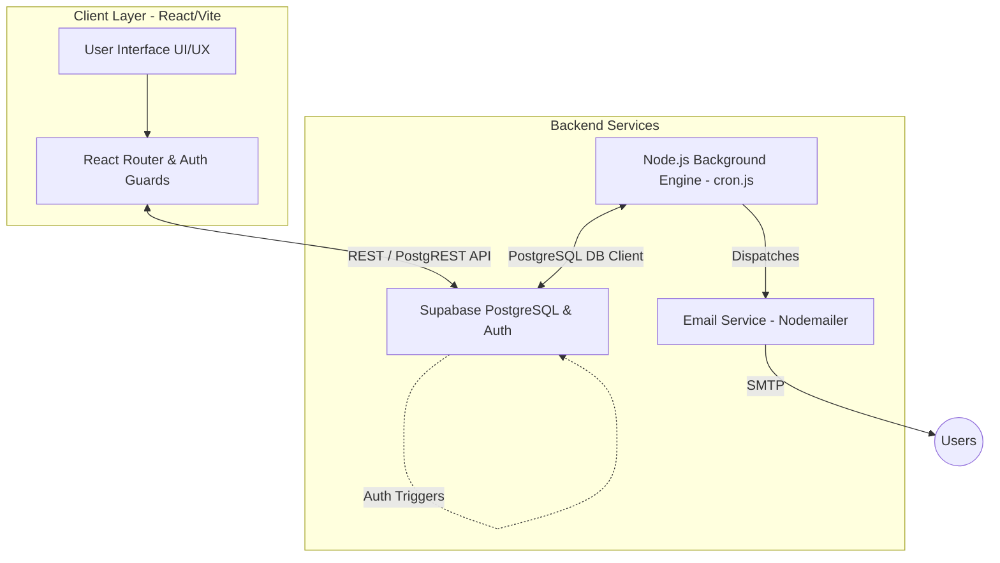

# GoalFlow Performance Portal: Architecture & Features Documentation

## 1. System Architecture Overview

The GoalFlow Performance Portal is built using a modern, decoupled client-server architecture ensuring high availability, strict data security, and seamless background processing.

### Architecture Diagram

### Technology Stack & Reasoning
- **Frontend**: **React (Vite)**. Chosen for lightning-fast HMR and modular component building. Uses **Vanilla CSS** with a premium Glassmorphic design to ensure rendering speed and zero utility-class bloat.
- **Database & Auth**: **Supabase (PostgreSQL)**. Chosen for its out-of-the-box Row Level Security (RLS), instant REST APIs, and powerful DB triggers that seamlessly sync Auth profiles to public tables.
- **Background Engine**: **Node.js Daemon (`cron.js`)**. Chosen to handle long-running, asynchronous, and calendar-dependent tasks (like calculating escalations) without blocking the frontend client or relying on user-triggered events.
- **Communication**: **Nodemailer**. Chosen for robust SMTP handling with customizable priority configurations (e.g., filtering out low-priority alerts).

---

## 2. Core Modules & Features

### 2.1 Employee Module
- **Goal Setting**: Employees can draft goals, assign metrics (UoM), and map to organizational Thrust Areas.
- **Weightage Validation**: The system strictly enforces that goal weightages must mathematically sum to exactly 100% before submission is allowed.
- **Quarterly Check-ins**: Employees provide progress actuals during active quarter windows (Q1, Q2, Q3, Q4). The system calculates a `computed_score` based on their target vs actuals.

### 2.2 Manager (L1) Module
- **Team Dashboard**: A dedicated routing scope (`/manager/*`) where managers view their direct reports' progress.
- **Goal Sheet Approvals**: Managers can review submitted goals, approve them, or send them back for rework with comments.
- **Check-in Reviews**: Managers evaluate employee quarterly check-ins and log official feedback.
- **Effectiveness Scoring**: The system dynamically calculates a Manager Effectiveness Score based strictly on their direct reports' compliance rates (Total Completed Check-ins / Total Expected Check-ins × 100).

### 2.3 Admin / HR Module
- **Analytics Dashboard**: Real-time graphs showing goal distributions, thrust area alignments, and status tracking across the organization.
- **Compliance Directory**: A premium glassmorphic matrix tracking exactly which employees have completed Q1-Q4 check-ins, rendering live completion percentages.
- **Goal Unlocking & Audit Trails**: Admins can force-unlock approved goals for mid-year course corrections. The system mandates a justification reason and logs this securely in the `audit_logs` table.
- **Dynamic System Settings**: An interactive database configuration panel to toggle MFA, modify escalation durations (minutes/hours/days), and update email notification thresholds instantly without code redeployments.

---

## 3. Background Processing (Cron Engine & Escalations)

The standalone Node.js cron engine (`cron.js`) evaluates the entire database every minute to enforce operational compliance.

### 3.1 Multi-Level Cascading Escalations
The system features a highly robust, rule-based escalation chain that dynamically scales its severity based on how much time has passed since the deadline breach.

**The Escalation Rules:**
- **E1**: Employee overdue on Goal Submission.
- **E2**: Manager overdue on Goal Approval.
- **E3**: Employee overdue on Quarterly Check-in.
- **E4**: Manager overdue on Check-in Review.

**The Cascading Math:**
The engine compares the current time against the event start time. Based on the duration (`diff`) and the configurable `deadline` setting, it cascades up the chain of command:
1. **Level 1 (Over 1× Deadline)**: Auto-notifies the responsible user (Employee or Manager).
2. **Level 2 (Over 2× Deadline)**: Escalates to the next tier. If an employee is late, the Manager is notified. If a manager is late, HR/Admin is notified.
3. **Level 3 (Over 3× Deadline)**: Maximum severity. Skip-level alerts are dispatched directly to the HR/Admin board for immediate intervention.

### 3.2 Notification & Email Routing
- **In-App Notifications**: Saved to the `notifications` table and rendered via a slide-out drawer on the user's dashboard.
- **Email Throttling**: The `emailService.js` module checks the global `email_notifications_level` (important, all, none) to determine if a physical SMTP email should be dispatched alongside the in-app alert, preventing inbox fatigue.

---

## 4. Handled Edge Cases & Resilience Engineering

1. **"Time-Jump" / Stale Date Bypassing**
   - *Scenario*: A cycle was created months ago, but the deadline is configured to 7 days.
   - *Handled*: The math engine recognizes that the breach is drastically overdue (e.g., `diff > 3 * deadline`). Instead of triggering L1, waiting 7 days for L2, etc., it accurately recognizes the massive delay and jumps straight to **Level 3 Escalation** instantly.
2. **Settings Initialization Fallbacks**
   - *Scenario*: The `app_settings` database table is freshly seeded and lacks automated chronological properties like `auto_active_quarter`.
   - *Handled*: The seeding script (`seed_users.js`) automatically calculates the correct financial quarter based on the server's current month (e.g., May maps to `phase1`) and upserts the exact fallback configuration into the database instantly.
3. **Privilege Isolation (RLS Grants)**
   - *Scenario*: Authenticated users attempting to maliciously modify feedback given by other managers via REST payload spoofing.
   - *Handled*: Supabase PostgreSQL `GRANT` and RLS policies dynamically map the user's JWT `auth.uid()` against the `manager_id` of the employee, strictly enforcing that managers can only `UPDATE/DELETE` comments on their own direct reports.
4. **Zero-Division Prevention in Analytics**
   - *Scenario*: Calculating manager effectiveness for a newly assigned manager who currently has exactly 0 direct reports.
   - *Handled*: Mathematical coalescing forces the denominator check to safely bypass the calculation, returning a clean `N/A` or `0%` rather than throwing a fatal `NaN` crash in the React renderer.
5. **Dangling Redundant UI Modules**
   - *Scenario*: Settings panels being duplicated across sidebars and main dashboards.
   - *Handled*: Consolidated configuration workflows gracefully by routing all database parameter toggles into the central Admin Dashboard, deleting the standalone routes and purging their legacy components from the filesystem to minimize bundle size.
