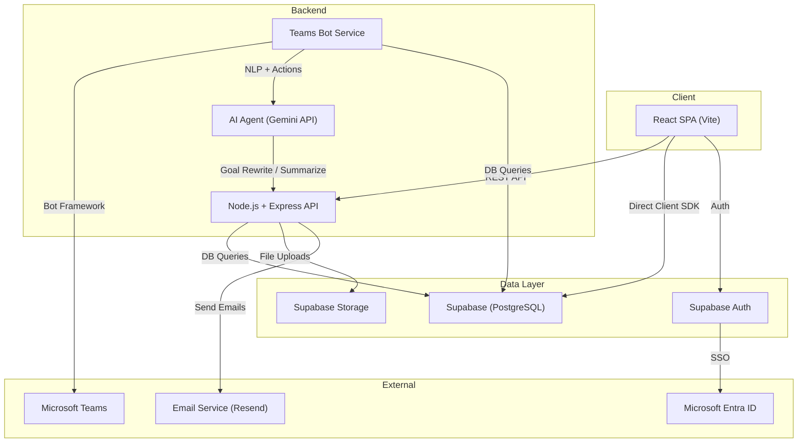
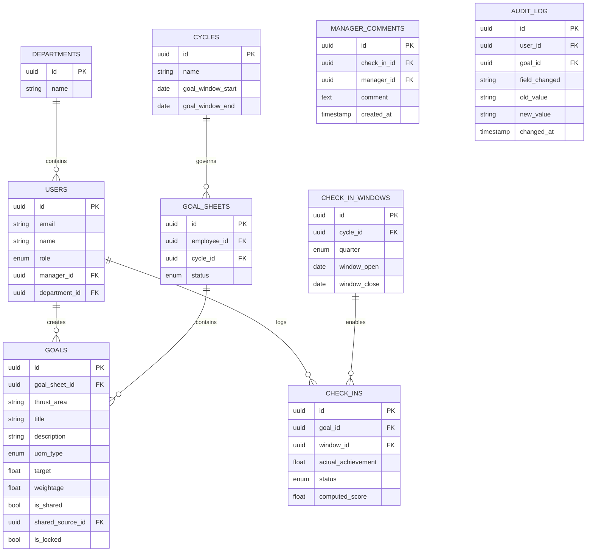

# AtomQuest Goal Portal — General Overview

## 1. Project Vision

A web-based **Goal Setting & Tracking Portal** that digitizes the full employee performance lifecycle — from goal creation and manager approval to quarterly check-ins and organizational reporting. The portal replaces fragmented spreadsheet-based tracking with a structured, role-based, audit-ready system.

**Novel Differentiator:** A Microsoft Teams Bot Agent that allows employees and managers to interact with the portal conversationally — updating goals, logging progress, and receiving nudges — without ever opening the web app.

---

## 2. Tech Stack

| Layer | Technology | Why |
|---|---|---|
| **Frontend** | React 18 (Vite) + React Router | Fast SPA with modern DX; Vite for instant HMR |
| **UI Library** | Shadcn/ui + Radix Primitives | Accessible, customizable components; no heavy CSS framework lock-in |
| **Styling** | Vanilla CSS + CSS Modules | Full control over design system; no Tailwind dependency |
| **State Management** | Zustand | Lightweight, minimal boilerplate |
| **Backend** | Node.js + Express | Simple REST API layer; easy to deploy |
| **Database** | Supabase (PostgreSQL) | Managed Postgres with built-in Auth, Row Level Security (RLS), Realtime subscriptions, and Storage |
| **Authentication** | Supabase Auth + Microsoft Entra ID (SSO) | Supabase handles session management; Entra ID for enterprise SSO (bonus) |
| **Teams Bot** | Microsoft Bot Framework SDK (Node.js) + Azure Bot Service | Official SDK for Teams integration; handles conversation state |
| **AI Agent** | Google Gemini API (or OpenAI) | Powers SMART Goal rewriting, feedback summarization, and the conversational Teams bot |
| **Email** | Resend or Supabase Edge Functions + SMTP | Transactional emails for notifications and escalations |
| **Hosting (Frontend)** | Vercel | Free tier, instant deploys, preview URLs |
| **Hosting (Backend)** | Railway or Azure App Service | Affordable Node.js hosting; Azure preferred if using Teams Bot |
| **Hosting (Bot)** | Azure Bot Service | Required for Teams channel registration |

---

## 3. High-Level Architecture



### Data Flow Summary
1. **React SPA** communicates with the **Express API** for business logic (goal CRUD, approvals, check-ins).
2. **Supabase Client SDK** is used directly from the frontend for Auth and Realtime subscriptions (live dashboard updates).
3. **Express API** handles all write operations that require validation, role checks, and audit logging.
4. **Teams Bot** receives messages via Azure Bot Service, processes intent using the **AI Agent**, and calls the same Express API endpoints.
5. **Supabase RLS** enforces row-level security so even direct client queries are safe.

---

## 4. Module Breakdown

The project is divided into **4 development phases**, ordered by priority and dependency.

### Phase A — Foundation (Days 1–2)
| # | Module | Description |
|---|---|---|
| A1 | **Auth & Session Management** | Supabase Auth with email/password login; JWT-based sessions; role stored in user metadata |
| A2 | **Role-Based Access Control** | Three roles: Employee, Manager (L1), Admin/HR. Middleware + RLS policies per role |
| A3 | **Org Hierarchy & User Management** | Admin can define reporting lines (Employee → Manager). CRUD for users and departments |
| A4 | **UI Shell & Navigation** | App layout with sidebar, role-based navigation, and responsive design |

### Phase B — Goal Lifecycle (Days 2–4)
| # | Module | Description |
|---|---|---|
| B1 | **Goal Creation & Submission** | Employee creates up to 8 goals with Thrust Area, UoM, Target, Weightage. Validation enforced |
| B2 | **Manager Approval Workflow** | Manager reviews submitted sheets; inline edit or return for rework; lock on approval |
| B3 | **Shared Goals** | Admin/Manager pushes a departmental KPI to multiple employees; read-only title/target, editable weightage; synced achievement |
| B4 | **Goal Locking & Admin Unlock** | Once approved, goals are immutable unless Admin explicitly unlocks them |

### Phase C — Tracking & Reporting (Days 4–6)
| # | Module | Description |
|---|---|---|
| C1 | **Quarterly Check-in (Employee)** | Employee logs Actual Achievement and selects status per goal within the active window |
| C2 | **Manager Check-in & Feedback** | Manager views Planned vs. Actual; adds structured comments per employee |
| C3 | **Progress Score Engine** | Auto-compute scores based on UoM type (Min, Max, Timeline, Zero) |
| C4 | **Cycle Management (Admin)** | Admin configures check-in windows (open/close dates) per quarter |
| C5 | **Achievement Report Export** | CSV/Excel export of Planned vs. Actual for all employees |
| C6 | **Completion Dashboard** | Real-time view of check-in completion rates across the org |
| C7 | **Audit Trail** | Log all post-lock changes with timestamp, user, old value, new value |

### Phase D — Bonus & Differentiators (Days 6–8)
| # | Module | Description |
|---|---|---|
| D1 | **Microsoft Entra ID SSO** | Single Sign-On via Azure AD; auto-sync org hierarchy and roles |
| D2 | **Email Notifications** | Transactional emails for submission, approval, rejection, and check-in reminders |
| D3 | **Teams Bot Agent** | Conversational bot in MS Teams for goal updates, progress logging, and nudges |
| D4 | **Escalation Engine** | Rule-based auto-escalation if deadlines are missed (Employee → Manager → HR) |
| D5 | **Analytics Dashboard** | QoQ trends, heatmaps, goal distribution charts, manager effectiveness metrics |
| D6 | **AI: SMART Goal Assistant** | LLM rewrites vague goals into SMART format |
| D7 | **AI: Feedback Summarizer** | LLM polishes quick manager notes into professional feedback |

---

## 5. Database Entity Overview



---

## 6. API Structure (RESTful)

| Prefix | Scope |
|---|---|
| `POST /api/auth/*` | Login, register, refresh, SSO callback |
| `GET/POST /api/users/*` | User CRUD, org hierarchy |
| `GET/POST /api/departments/*` | Department management |
| `GET/POST /api/cycles/*` | Cycle & window management (Admin) |
| `GET/POST /api/goal-sheets/*` | Goal sheet CRUD, submission, approval |
| `GET/POST /api/goals/*` | Individual goal CRUD, shared goal push |
| `GET/POST /api/check-ins/*` | Employee achievement logging |
| `GET/POST /api/manager-reviews/*` | Manager check-in comments |
| `GET /api/reports/*` | Export & dashboard data |
| `GET /api/audit-log/*` | Audit trail queries (Admin) |
| `POST /api/ai/*` | SMART goal rewrite, feedback summarize |
| `POST /api/bot/messages` | Teams Bot webhook endpoint |

---

## 7. Deployment Strategy

```
┌─────────────────────────────────────────────────────┐
│                   Vercel (Frontend)                  │
│              React SPA + Static Assets               │
├─────────────────────────────────────────────────────┤
│              Railway / Azure App Service             │
│           Node.js Express API + Bot Service          │
├─────────────────────────────────────────────────────┤
│                  Supabase (Cloud)                    │
│    PostgreSQL │ Auth │ Storage │ Edge Functions       │
├─────────────────────────────────────────────────────┤
│                Azure Bot Service                     │
│         Teams Channel Registration + Webhook         │
└─────────────────────────────────────────────────────┘
```

**Cost Optimization (Evaluation Criteria #6):**
- Supabase Free Tier: 500MB DB, 1GB storage, 50k monthly auth users
- Vercel Free Tier: Unlimited static deploys
- Railway Starter: $5/month for always-on backend
- Azure Bot Service: Free tier for up to 10k messages/month

---

## 8. Development Timeline (8-Day Sprint)

| Day | Focus | Deliverables |
|---|---|---|
| **Day 1** | Setup + Auth + DB Schema | Supabase project, DB migrations, Auth flow, role middleware |
| **Day 2** | UI Shell + Org Hierarchy | Layout, navigation, Admin user/dept management |
| **Day 3** | Goal Creation + Validation | Employee goal form, validation engine, submission flow |
| **Day 4** | Approval Workflow + Shared Goals | Manager review UI, inline editing, shared goal push |
| **Day 5** | Check-in System + Score Engine | Quarterly update UI, score computation, manager feedback |
| **Day 6** | Reports + Audit + Admin Panel | CSV export, completion dashboard, audit trail, cycle config |
| **Day 7** | Teams Bot + AI Features | Bot Framework setup, conversational agent, SMART goal assist |
| **Day 8** | Polish + Deploy + Demo Prep | Bug fixes, responsive design, hosting, demo script |
